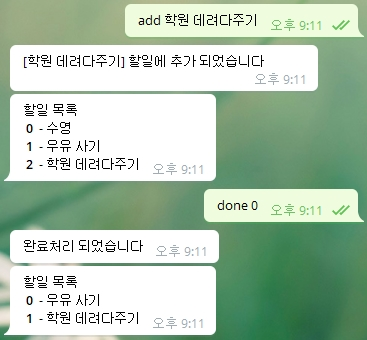

# bot_telegram_todo

### Description : 할일 목록을 관리하는 텔레그램 챗봇

1. 텔레그램 앱에서 동작
2. Node.js 로 구현 
3. 빌드는 AWS EC2 에 배포
4. 데이타는 Firebase firestore에 저장
5. 봇 사용법 
   - URL : t.me/toto_todo_bot
   - 사용법
     - list
     - add <할일>
     - done <목록번호>
     - 

### Tech

- Node.js
- 플랫폼 : Telegram Bot API
- 인프라 : AWS, Firebase 

### Reference

- Telegram Bot API  : https://core.telegram.org/bots/api
- Telegram-node-bot : https://github.com/naltox/telegram-node-bot 

### Commit desc

- 내부 변수에 데이타 저장 : git checkout 23db4fa
